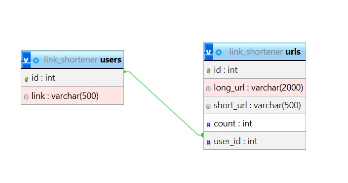

# Файлы
- index.php - содержит всебе логику перенаправления по ссылкам и отрисовки шаблонов.
- Style.css - стили для index.php.

- routerUrls.php - служит для направления ajax запросов. Принимает данные и передает их в класс для работы с url (UrlOperator.php).
- UrlOperator.php - класс для работы с базой данных. Содержит методы для чтения и создания ссылок
- main.php - файл с настройками

- .htaccess - файл для сервера Apach. Перенаправляет на index php даже если путь указан не верно.

# Папки
- js - содержит файлы JavaScript.
- templates - содержит в себе шаблоны верстки.

# База данных
